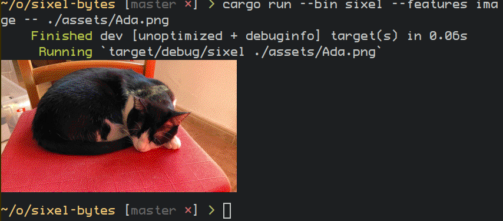

# sixel-bytes



Encode an image with [sixel-sys].

[sixel-sys]: https://crates.io/crates/sixel-sys

This is my first crate that uses `unsafe` and FFI. Please inspect the source code yourself, the
crate is very small. PRs are welcome.

To write a sixel to a file, [sixel-rs] is probably safer and has more options.

[sixel-rs]: https://crates.io/crates/sixel-rs

## Examples

Encode a generated image to sixel and print it:
```rust
let mut bytes: Vec<u8> = Vec::new();
for x in 0..255 {
    for y in 0..255 {
        bytes.append(&mut vec![x, 0, y]);
    }
}

let data = sixel_bytes::sixel_string(
    &bytes,
    255,
    255,
    sixel_bytes::PixelFormat::RGB888,
    sixel_bytes::DiffusionMethod::Atkinson,
).unwrap();
assert_eq!(&data[..3], "\u{1b}Pq");
```

Encode an image from the [image] crate to sixel and print it:
```rust
let image = image::io::Reader::open("./assets/Ada.png")
    .unwrap()
    .decode()
    .unwrap()
    .into_rgba8();
let bytes = image.as_raw();

match sixel_bytes::sixel_string(
    bytes,
    image.width() as _,
    image.height() as _,
    sixel_bytes::PixelFormat::RGBA8888,
    sixel_sys::DiffusionMethod::Stucki,
) {
    Err(err) => eprintln!("{err}"),
    Ok(data) => print!("{data}"),
}
```

## Binaries

`sixel <path/to/image>` uses the [image] crate to load an image with supported formats, convert
to RGBA8888, encode to sixel, and dump the resulting string to stdout. It must be built with
the `image` feature.

`test-sixel` just generates some 255x255 image with a gradient and dumps it to stdout.

## Features
The `image` feature is disabled by default but needed for the `sixel` binary.

[image]: https://crates.io/crates/image

Current version: 0.2.1

License: MIT
